# Asociación sin ánimo de lucro ALMA LACTANCIA 

<div>
  
</div>

<br/>

_Proyecto de voluntariado para la ONG Alma Lactancia de Santiago de Compostela. 
Página web donde consultar recursos, eventos y actividades sobre lactancia organizadas por la asociación en las ciudades de Santiago de Compostela y Culleredo._

<ol id='menu'>
  <li>
    <a href='#📋-descripción'>Descripción</a>
  </li>
  <li>
    <a href="#⚙-inicialización">Inicialización</a>
    <ul>
      <li><a href='#instalación'>Instalación</a></li>
    </ul>
  </li>
  <li>
    <a href="#🎨-diseño">Diseño</a>
  </li>
  <li>
    <a href="#💻-tech-stack">Tecnologías utilizadas</a>
  </li>
</ol>

## 👩‍💻 Desarrolladores
<a href="https://github.com/GuillermoGCP"></a>
<a href="https://github.com/albafresnillo"></a>
<a href="https://github.com/Roberto-Panella"></a>
<a href="https://github.com/danvei0707"></a>
<a href="https://github.com/helenartola"></a>

## 📅 Scrum Master
<a href="https://github.com/Marielgtz">
  
</a>

<br/>

## 📋 Descripción
- Los usuarios pueden:
  - Ver las próximas actividades organizadas por la Asociación.
  
    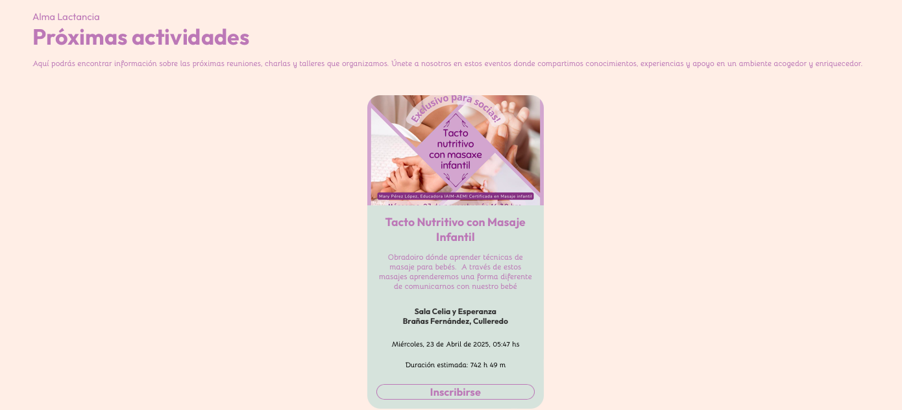

  - Ser redireccionados a la página del evento en el que estén interesados para poder rellenar el formulario de inscripción.
  	
	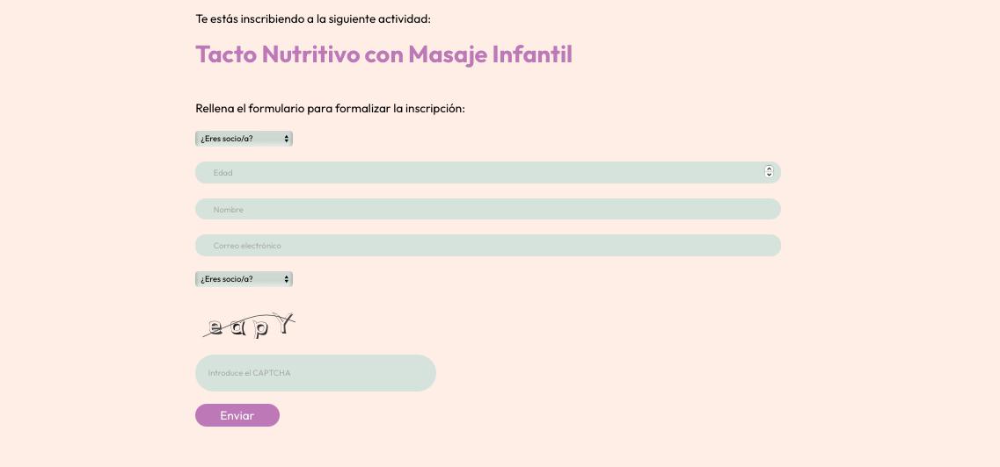
  
  - Obtener información sobre lo que hace la Asociación y sus colaboradores.
  
    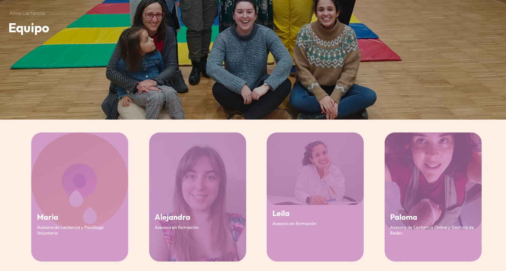
	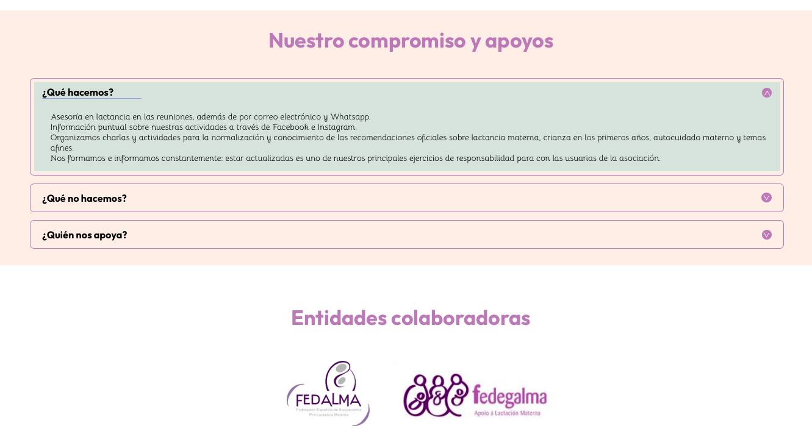
  
  - Leer experiencias de participantes en anteriores reuniones de Alma Lactancia.
  
    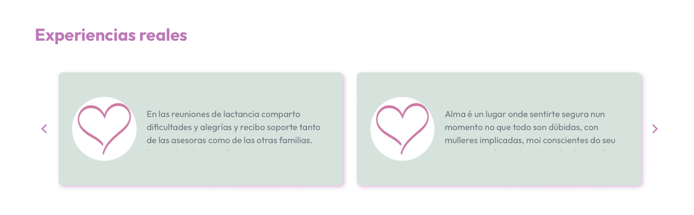

  - Visualizar el calendario mensual para conocer la fecha, hora y descripción de las próximas actividades.

    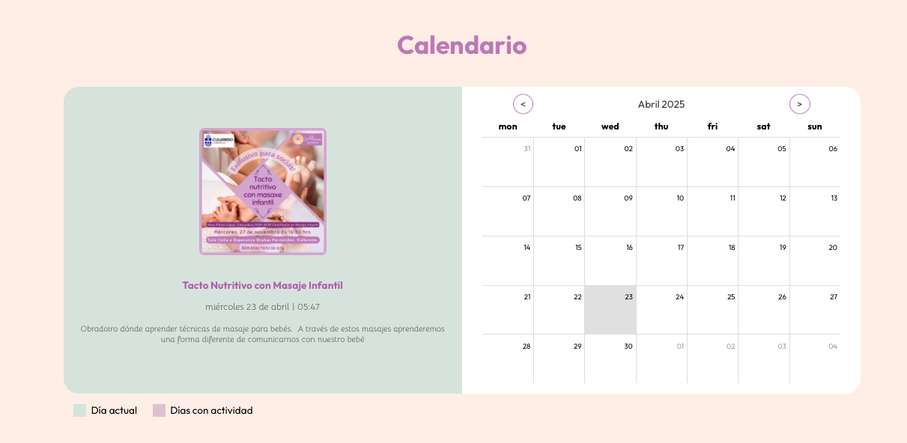

  - Visualizar fotos de anteriores actividades en su cuenta de instagram.
  
    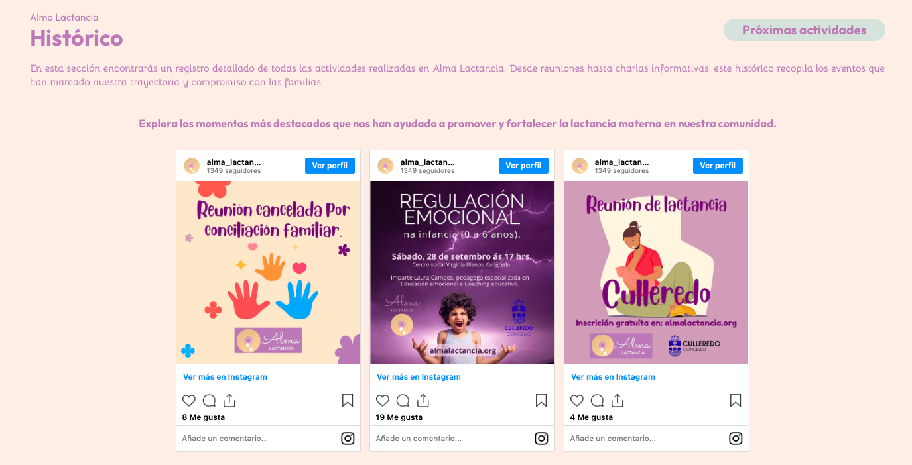

  - Acceder a la sección de Biblioteca, donde se encuentran los diferentes recursos educativos sobre lactancia.

    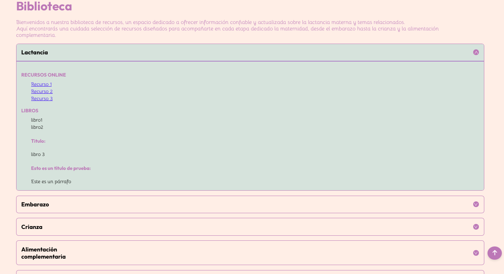
  
  - Ponerse en contacto con la Asociación para cualquier duda o aclaración que necesiten.
  
    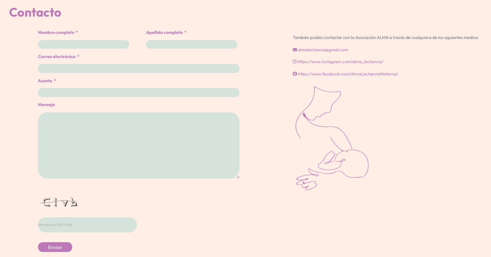

- El usuario admin puede:
	- Acceso completo a todas las funciones de gestión, lo que incluye la capacidad de añadir, editar y eliminar diferentes secciones de la web directamente desde el panel de administrador. 
  
		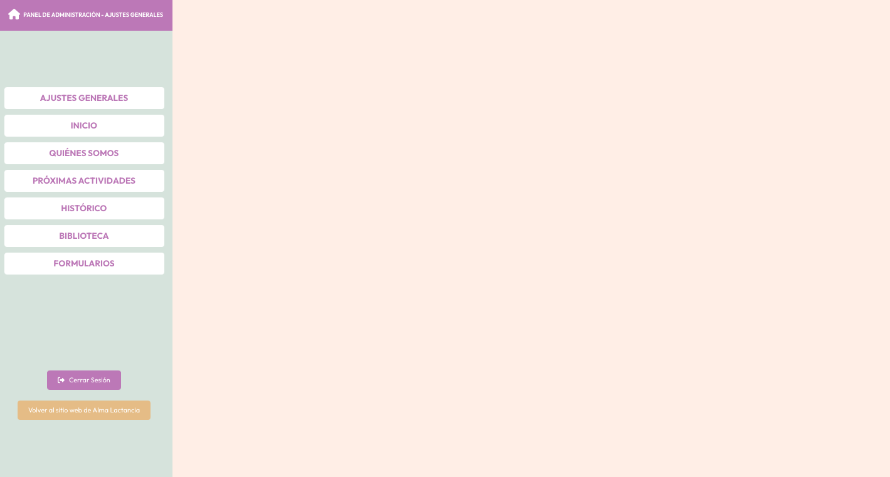

  - Cambiar el logo, link de instagram y facebook y correo electrónico.

    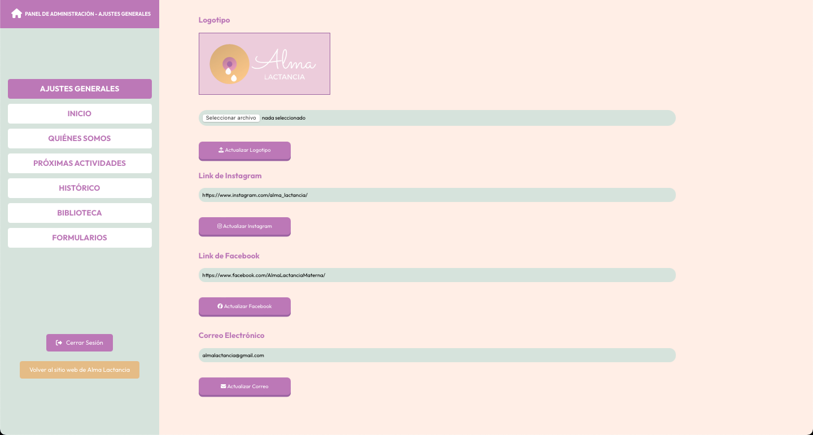

  - Cambiar la imagen de inicio y el titular, la sección de Nosotras y añadir o eliminar experiencias.

    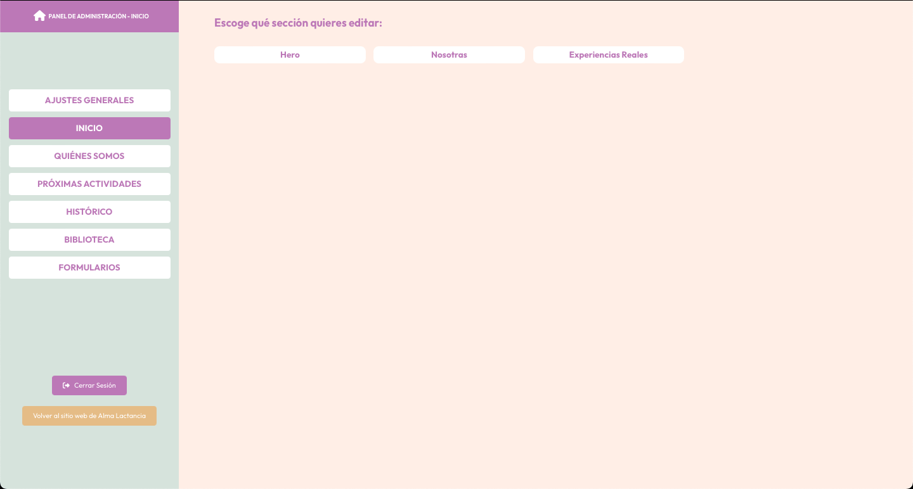

  - Añadir, editar o eliminar los miembros del equipo y los colaboradores.

    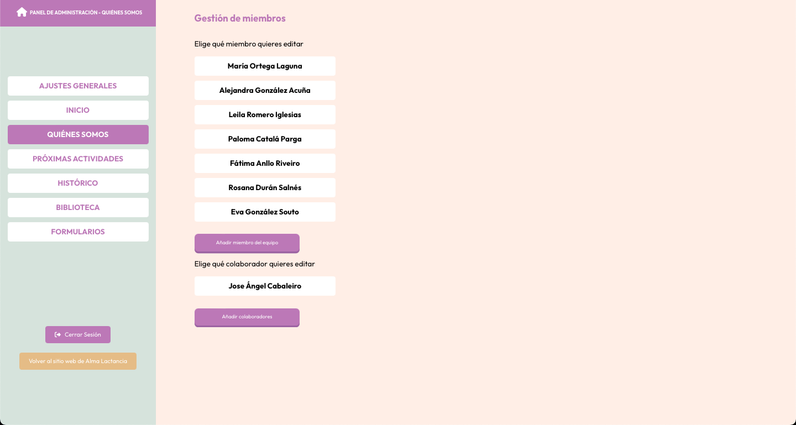

  - Añadir, editar, cancelar o eliminar actividades.
  
    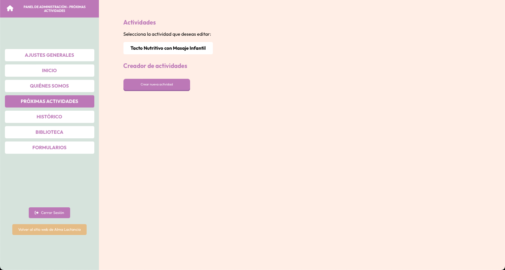

  - Añadir nuevas publicaciones del perfil del instagram.

    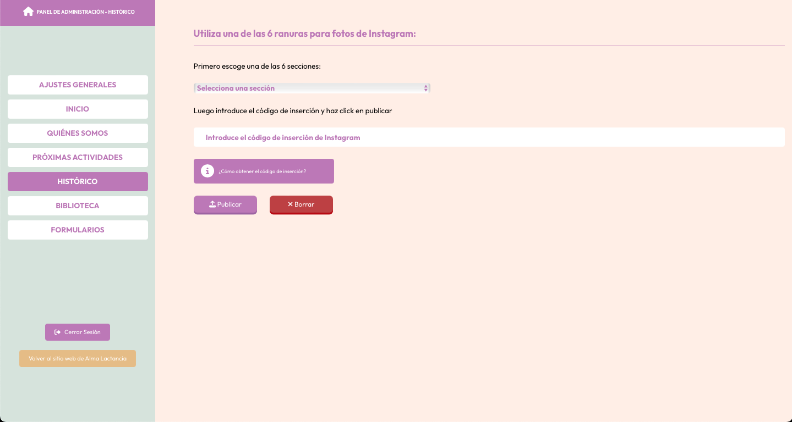

  - Añadir, editar o eliminar recursos.

    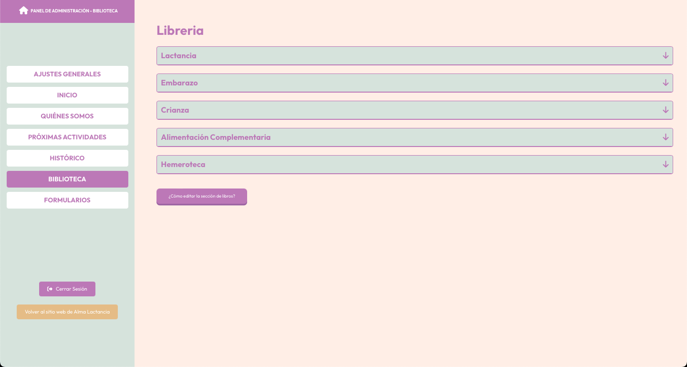

  - Crear, editar o eliminar formularios.

    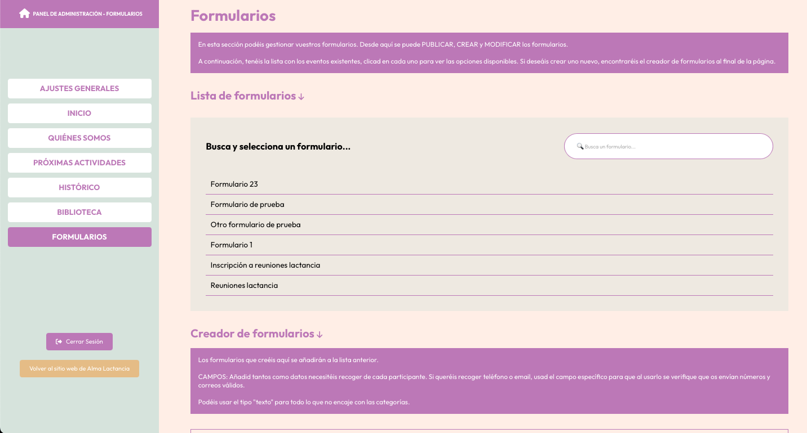
  
<a href="#menu">Volver arriba</a>

## ⚙ Inicialización
Para inicializar la app debes seguir los siguientes pasos:

### Instalación
- Clonar el repositorio:
  
  ```
  git clone git@github.com:Marielgtz/alma-lactancia-hack-a-boss-.git
  ```

- Instalar las dependencias necesarias:
  
  ```
  npm i
  ```

- Añadir un archivo `.env` cumplimentando los datos aportados en el archivo `.env.example` como ejemplo.

- Arrancar el servidor
  
  ```
  npm run dev
  ```

## 🎨 Diseño
Diseñada con [Figma](https://www.figma.com/proto/6UCLBJaESI8DXv5qJh77vJ/Alma-Lactancia---Mobile?node-id=5-542&t=bfmegxNq9vnD7stJ-1&scaling=scale-down&content-scaling=fixed&page-id=0%3A1&starting-point-node-id=5%3A542 / https://www.figma.com/proto/D0TbzgRQWNX8MC9CwQ2Bun/Alma-Lactancia-Desktop?node-id=439-299&node-type=FRAME&t=zhz767OBdVpcdIQN-0&scaling=scale-down&content-scaling=fixed&page-id=0%3A1&starting-point-node-id=439%3A299) para mejorar así la planificación de la App y poder comprender los datos necesarios y la manera más efectiva de representarlos, pudiendo mantener una coherencia visual y funcional en todo el desarrollo.

Responsive, amigable y fácilmente accesible desde múltiples dispositivos. Cumpliendo criterios de accesibilidad para que pueda ser usada por cualquier persona.

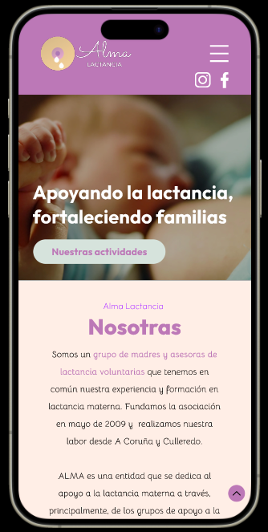
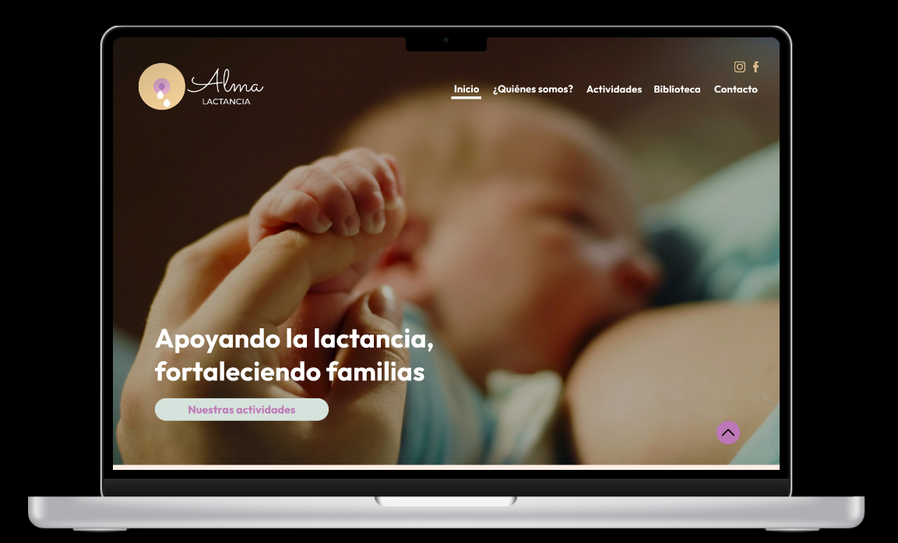

## 💻 Tech Stack

<div align="center">

  HTML5 | CSS3 | React | Vite | Material UI | React Router | Axios | React Hook Form | React Big Calendar | React Calendar | React Toastify | Font Awesome | Date-fns | Google APIs | UUID | Testing Libraries

</div>


<a href="#menu">Volver arriba</a>